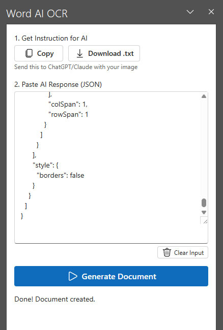

#  Word AI OCR Plugin

Automate document layout and text reconstruction from photos or scans directly into Microsoft Word **without any paid APIs or API keys**.

---

## 🚀 The "No-API" Philosophy
Unlike traditional OCR solutions that require expensive subscriptions or complex API integrations (like GPT-4 Vision API), this plugin is built for the **standard user interface**:
- **ZERO API Costs**: You don't need to pay for tokens or manage API keys.
- **Works Everywhere**: Use any AI you already have access to (ChatGPT Free/Plus, Claude, Gemini, local LLMs).
- **Privacy & Control**: You decide which AI to trust with your data.

### How it works:
1. **Open your favorite AI chat** (web or mobile app).
2. **Send your document image** with the instruction provided by the plugin.
3. **Copy the JSON response** and paste it into Word. The plugin handles the heavy lifting of drawing tables, lists, and styles.

## ✨ Key Features
- **Complex Tables**: Reconstructs exact table grids with content.
- **Lists & Hierarchy**: Handles numbered and bulleted lists, including nested levels.
- **True Styling**: Preserves font families (e.g., Times New Roman), sizes, bold/italic, and alignment.
- **Seamless Flow**: No background servers needed for the release version.

## 🛠 Installation

### Option 1: One-Click Installer (Windows)
1. Download `INSTALL_PLUGIN.bat` from the repository.
2. Run it.
3. In Word, go to **Insert** -> **My Add-ins** -> **SHARED FOLDER** and enable the plugin.

### Option 2: Manual Installation
1. Download `manifest-release.xml`.
2. **Shared Folder Method** (Recommended for Windows):
    - Place the manifest in a local folder (e.g., `C:\Addins`).
    - Share this folder (Right-click -> Properties -> Sharing -> Share -> Everyone).
    - In **Word**: Go to `File` -> `Options` -> `Trust Center` -> `Trust Center Settings` -> `Trusted Add-in Catalogs`.
    - Add the **Network Path** of your shared folder (e.g., `\\YOUR-PC\Addins`) and check **Show in menu**.
    - Restart Word, go to `Insert` -> `My Add-ins` -> `SHARED FOLDER`.

---

## 👨‍💻 Development
To run the project locally:
1. `npm install`
2. `npm start` (for dev mode) or `START_AI_PLUGIN.bat` (for local production mode).
